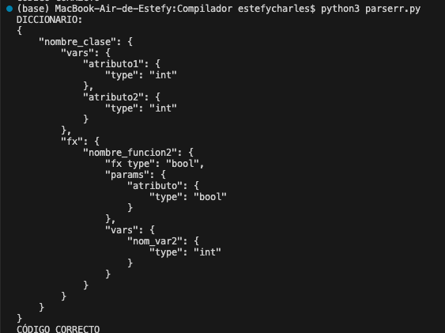
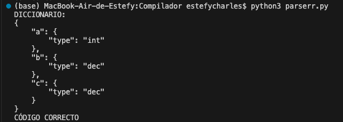
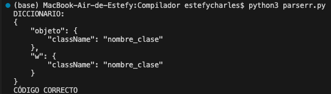
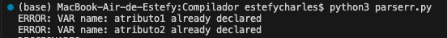

# Compilador

## Avance 1
Lexer: Definición de tokens, palabras reservadas, expresiones regulares y manejo de errores.

Parser: Reglas gramaticales para inicio de programa y definición y asignación de variables con operadores, manejo de error sintatico

# Avance 2
Directorio:
    - Funciones: guarda su nombre, tipo, parámetros y variables
    
    - Clases: guarda su nombre, sus atributos y sus métodos
    
    - Variables: guarda su nombre y tipo
    
    - Objetos: guarda el nombre de la clase de la cual proviene y su id
    
    - Verifica que no se puedan declarar funciones, clases o variables previamente declaradas
    

