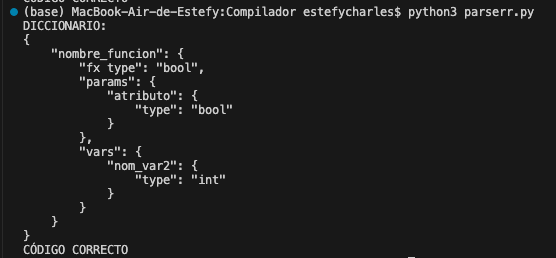

# Compilador

## Avance 1
Lexer: Definición de tokens, palabras reservadas, expresiones regulares y manejo de errores.

Parser: Reglas gramaticales para inicio de programa y definición y asignación de variables con operadores, manejo de error sintatico

## Avance 2
Se desarrolló el directorio de procedimientos y la tabla de variables. 

Funciones: guarda su nombre, tipo, parámetros y variables

 

Clases: guarda su nombre, sus atributos y sus métodos

Variables: guarda su nombre y tipo

Objetos: guarda el nombre de la clase de la cual proviene y su id
 

Verifica que no se puedan declarar funciones, clases o variables previamente declaradas

## Avance 3
Se generan cuádruplos para las expresiones aritméticas, el estatuto de asignación, output e input.

## Avance 4
Se generan cuádruplos de estatutos condicionales: if else y while. 

## Avance 5
Se generan cuádruplos de funciones.

## Avance 6
Máquina virtual de expresiones artiméticas.

## Avance 7
Máquina virtual de estatutos condicionales y ciclos.

## Avance 8
Máquina virtual de funciones void, de retorno y recursividad.

